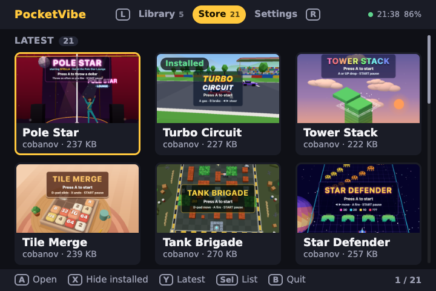

<p align="center">
  
</p>

<h1 align="center">PocketVibe</h1>

<p align="center">
  <strong>Play three.js games on your retro handheld. Make your own with AI.</strong><br>
  A launcher, a game store and a starter kit for ROCKNIX and Android handhelds.
</p>

<p align="center">
  <a href="https://pocketvibe.cobanov.dev/download/rocknix"><strong>Download for ROCKNIX</strong></a> ·
  <a href="https://pocketvibe.cobanov.dev/download/android"><strong>Download for Android</strong></a> ·
  <a href="https://pocketvibe.cobanov.dev">Website</a> ·
  <a href="https://pocketvibe.cobanov.dev/how/">How it works</a> ·
  <a href="https://github.com/cobanov/pocketvibe/issues">Issues</a>
</p>

PocketVibe turns a retro handheld into a little console for web games. It comes with 21 three.js
games, a store to download more with one button, and everything you need to make your own with
an AI coding tool like Claude Code, Codex or Cursor and play it on your own device. Free and open
source, no account needed.

<p align="center">
  <a href="docs/screenshots/library.png"></a>
  <a href="docs/screenshots/store.png"></a>
  <br>
  <sub>The launcher at the handheld's 720×480. Play every game in your browser on the <a href="https://pocketvibe.cobanov.dev">website</a>.</sub>
</p>

## A console for the games you vibe-code.

- **Games in one press.** It starts with five games, and the store has the rest: press A, watch it download, play. Updates arrive on their own.
- **Runs on ROCKNIX and Android.** Tested on the Anbernic RG34XX SP, RG34XX and RG DS with ROCKNIX, and the RG Rotate with Android.
- **Fits every screen.** Games fill 3:2, 4:3, 16:9 and square screens, and on the two-screen RG DS a game can use both.
- **Feels like a console.** Menus with their own sounds and music, everything on the handheld's buttons, and Start + Select to leave a game any time.
- **Make your own with AI.** Give your coding agent [one link](https://pocketvibe.cobanov.dev/agents.md): it learns the handheld's screen, buttons and measured limits, and writes games that hold 60 fps there.
- **Play it on your handheld while you make it.** `npx pocketvibe serve` puts the game you are working on in your handheld's store, and every change arrives as an update.
- **Share it.** `npx pocketvibe publish` sends your game to the store; once it is reviewed, it is on every PocketVibe handheld.

## Try it

Just curious? The [website](https://pocketvibe.cobanov.dev) runs the real launcher with every game
in your browser.

**On ROCKNIX** (not muOS or other firmware), with a 64-bit Arm chip, 1 GB of RAM, Wi-Fi and about
1 GB free on the SD card:

1. Download [PocketVibe.zip](https://pocketvibe.cobanov.dev/download/rocknix).
2. Turn on Samba in ROCKNIX's network settings, open the handheld's `games-roms` share and unzip it into `ports`.
3. Restart the handheld, open **Ports**, then **PocketVibe**. The first start sets up the game engine (about 150 MB, a minute and a half).

**On Android** (10 or newer): open [pocketvibe.cobanov.dev/download/android](https://pocketvibe.cobanov.dev/download/android) on the handheld and install the APK.

**Make a game:**

```sh
npm create pocketvibe@latest my-game
```

Then tell your AI tool: "Read https://pocketvibe.cobanov.dev/agents.md and follow it. Then make me
a PocketVibe game: ...". [Make a game](https://pocketvibe.cobanov.dev/make/) walks through the rest.

## Want to tinker?

On ROCKNIX, a small Python service and an HTML launcher run WPE WebKit and Cog from a Debian root;
on Android, a Kotlin app runs the same launcher in a WebView. The store is a Cloudflare Worker with
D1 and R2. [How it works](https://pocketvibe.cobanov.dev/how/) explains it all in a few minutes.

[Development](docs/development.md) ·
[Contributing](CONTRIBUTING.md) ·
[Rules for AI tools](template/AGENTS.md) ·
[Performance guide](docs/performance.md) ·
[Command line tool](packages/pocketvibe/README.md) ·
[Benchmarks](bench/README.md)

---

[MIT](LICENSE) · DejaVu fonts under the [Bitstream Vera license](site/public/fonts/LICENSE.txt) · Platform marks from [Simple Icons](https://simpleicons.org) (CC0)
