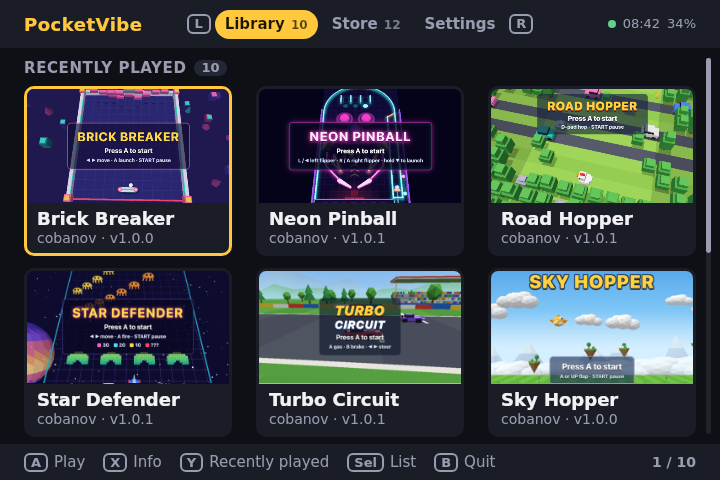
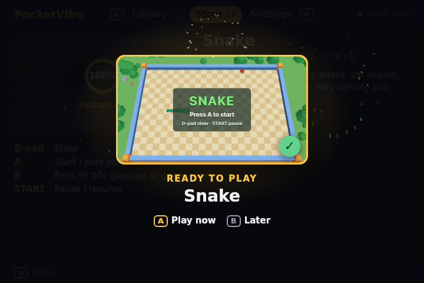

  

<h1 align="center">PocketVibe</h1>

  <strong>Make a game with AI. Play it on your handheld.</strong> 
  A launcher, a game store and a starter project for three.js games on ROCKNIX handhelds.

  <a href="https://github.com/cobanov/pocketvibe/releases/latest/download/PocketVibe.zip"><strong>Download PocketVibe</strong></a> ·
  <a href="https://pocketvibe.cobanov.dev">Website</a> ·
  <a href="docs/getting-started.md">Get started</a> ·
  <a href="https://github.com/cobanov/pocketvibe/issues">Issues</a>

PocketVibe is for people who make three.js games with AI coding tools like Claude Code or
Cursor and want to play them on a real handheld. It adds an app to the Ports menu of
ROCKNIX with a store of games made for the handheld's screen and buttons. No Linux, SSH or
porting needed: unzip it once and it keeps itself up to date.

  
  
   
  Captured on an Anbernic RG34XX SP at its 720×480. Try the launcher in your browser on the <a href="https://pocketvibe.cobanov.dev">website</a>.

## Your game, in your hands.

- **Get games from the store.** Pick one, watch it download, and play. Updates show up on their own.
- **Start from a project that knows the handheld.** `npm create pocketvibe` sets up Vite and three.js with an `AGENTS.md` that teaches your AI tool the screen, the buttons and the performance budget.
- **Keep it at 60 fps.** WPE WebKit draws with the handheld's GPU. Scenes that follow the rules ran at 60 fps on the H700; the same scenes written the usual way stayed under 6.
- **Publish with one command.** `npx pocketvibe publish` builds your game and sends it to the store. You sign in with GitHub.
- **Leave a game any time.** Hold Start + Select to go back to the launcher, or a little longer to quit.
- **Keep your saves.** Every game saves on its own, and Settings backs all saves up to the SD card.

## Try it

Just curious? The [website](https://pocketvibe.cobanov.dev) runs the real launcher with the
store's games in your browser.

On your handheld:

1. Download [PocketVibe.zip](https://github.com/cobanov/pocketvibe/releases/latest/download/PocketVibe.zip).
2. Unzip it into `roms/ports` on the handheld's SD card.
3. Restart the handheld and open **Ports**, then **PocketVibe**. The first start downloads the game engine, about 150 MB, over Wi-Fi.

To make your own game, run `npm create pocketvibe@latest my-game` and follow
[Get started](docs/getting-started.md). [Making games that run well](docs/performance.md)
has the handheld's measured limits.

**Made on an Anbernic RG34XX SP** with ROCKNIX. Other ROCKNIX handhelds may work, but are
not tested yet.

## Want to tinker?

On the handheld, a small Python service and an HTML launcher run WPE WebKit and Cog from a
Debian root. The store is a Cloudflare Worker with D1 and R2; the website is static.

[Development](docs/development.md) ·
[Rules for AI tools](template/AGENTS.md) ·
[Performance guide](docs/performance.md) ·
[Command line tool](packages/pocketvibe/README.md) ·
[Benchmarks](bench/README.md)

---

[MIT](LICENSE) · DejaVu fonts under the [Bitstream Vera license](site/public/fonts/LICENSE.txt)
