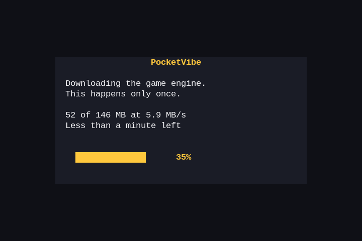

# Get started

PocketVibe has two halves: an app for your handheld, and a starter project for making games
on your computer. You can use either one without the other.

## Put PocketVibe on your handheld

You need a handheld running [ROCKNIX](https://rocknix.org) with Wi-Fi, and about 1 GB free on
its SD card. PocketVibe is made on an Anbernic RG34XX SP and also runs on the two-screen
Anbernic RG DS; other ROCKNIX handhelds may work. On a handheld that lets you choose its GPU
driver (the RG DS does), choose Panfrost in the system settings: with libmali, games run slowly.

1. Download [PocketVibe.zip](https://github.com/cobanov/pocketvibe/releases/latest/download/PocketVibe.zip).
2. Unzip it into the `roms/ports` folder of the handheld's SD card. Put the card in your computer,
   or copy the files over the handheld's network share.
3. Restart the handheld, open **Ports** and start **PocketVibe**.

The first start downloads PocketVibe's game engine (WPE WebKit, about 150 MB) and sets it up.
Over Wi-Fi this takes about two minutes, and it happens only once.

<p align="center">
  
</p>

### On an Android handheld

PocketVibe is also an Android app, made for handhelds such as the Anbernic RG Rotate and the
Retroid Pocket. It needs Android 10 or newer and an up-to-date Android System WebView
(version 94 or later; update it from the Play Store if games do not start).

1. On the handheld, open [pocketvibe.cobanov.dev/download/android](https://pocketvibe.cobanov.dev/download/android)
   in the browser. It downloads the newest `PocketVibe-<version>.apk`.
2. Open the download. When Android asks, allow the browser (or your file manager) to install
   apps, then tap **Install**.
3. Start **PocketVibe** from the app list.

The buttons work as on the other handhelds. Hold **Start + Select**, or press Android's back
button, to leave a game. A newer version installs over the old one and keeps your games and
saves.

### Using it

PocketVibe opens on your **Library**. **L** and **R** switch between Library, **Store** and
**Settings**. The bar along the bottom always shows what each button does on the screen you
are on.

- **A** plays a game in the Library, or opens a game's page in the Store, where **A** downloads it.
- **Y** changes the order: recently played, newest, most downloaded, A to Z or by category.
  **Select** switches between cards and a list.
- In the Store, **X** hides the games you already have.
- **B** goes back, and on the tabs it quits PocketVibe.
- In a game, hold **Start + Select** for a second to go back to the launcher, or for three
  seconds to quit PocketVibe.

PocketVibe checks for a new version of itself every few hours and offers it in
**Settings > App update**. Settings also backs up every game's saves to
`/storage/pocketvibe/backups` and restores them.

### If something goes wrong

- **PocketVibe is not in Ports.** Restart the handheld, or update the game lists from the
  system menu, so it finds the new port.
- **"The download did not finish."** Connect to Wi-Fi in the system settings and start
  PocketVibe again. It starts the download over.
- **A game will not start.** Remove it in its page in the Store (**Y**) and download it again.

## Make your own game

You need [Node.js](https://nodejs.org) 22 or newer and an AI coding tool such as Claude Code or
Cursor.

```sh
npm create pocketvibe@latest my-game
cd my-game
npm install
npm run dev
```

Open the address it prints. The game runs in a 720×480 frame, the handheld's screen (links under it
try the other screen shapes PocketVibe runs on), and your
keyboard stands in for its buttons:

| Handheld | Keyboard |
|---|---|
| D-pad | Arrow keys |
| A, B, X, Y | X, Z, S, A |
| L, R | Q, W |
| Start, Select | Enter, Shift |

**P** shows the performance overlay. It turns red when the game is too heavy for the handheld.

Then describe your game to your AI tool. `AGENTS.md` (also read through `CLAUDE.md`) tells it
the rules that keep a game at 60 fps on the handheld: the screen, the buttons, the materials to
use, and the budget for draw calls and triangles. The starter project comes with a small
example game, Coin Rush, to change or replace.

[Making games that run well](performance.md) explains the handheld's measured limits and how
to stay inside them, and how to measure a game on a handheld.

### Publish it to the store

Fill in `pocketvibe.json`, the game's store listing:

```json
{
  "id": "space-dodge",
  "title": "Space Dodge",
  "author": "your name",
  "version": "1.0.0",
  "description": "One or two sentences about the game.",
  "genre": "Arcade",
  "controls": { "D-pad": "Move", "A": "Shoot", "START": "Pause" }
}
```

The `id` is lowercase letters, digits and dashes, and stays the same for the life of the game.
Add a `cover.png` of 480×270, for example a picture of your title screen. Then:

```sh
npx pocketvibe publish
```

It builds the game, packs it with its listing and cover, and uploads it. You sign in with
GitHub: the tool uses the [GitHub CLI](https://cli.github.com) (`gh auth login`) or a
`GITHUB_TOKEN`. A new game or version appears in the store once it is reviewed, and
`npx pocketvibe status` shows where your uploads are. To publish an update, raise `version`
and run `publish` again.

### Try it on your own handheld first

With this repository and SSH access to the handheld, `device/play.sh` copies a built game into
PocketVibe's Library and starts it there:

```sh
npm run build
HANDHELD=root@192.168.1.42 path/to/pocketvibe/device/play.sh dist
```
